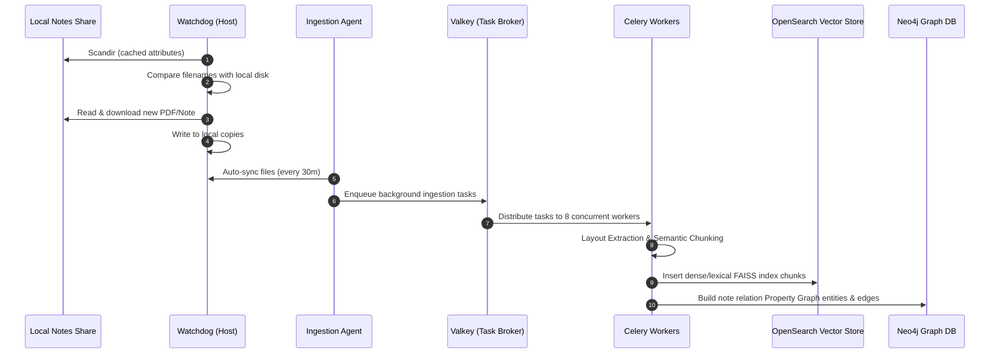

# 🏗️ Architecture Blueprint
## Personal Knowledge Assistant (PKA) & Document Ingestion System

This document outlines the complete architectural design, technology stack, and engineering rationales for the self-hosted **Personal Knowledge Assistant (PKA)**.

---

## 📊 1. High-Level System Architecture

The system is designed with a decoupled microservices architecture, running **100% locally** in a secure, self-hosted environment to guarantee absolute data privacy and eliminate cloud API dependencies.

```mermaid
graph TD
    %% Clients & Gateway
    User["Web Browser (React/Vite UI)"] -->|HTTPS / Port 8443| Nginx["Nginx Reverse Proxy"]
    Nginx -->|FastAPI Server (Synthesis Agent) / Port 8000| FastAPI["FastAPI Application Server"]
    Nginx -->|Grafana Dashboard / Port 3000| Grafana["Grafana Visualization"]
    
    %% Async Ingestion
    FastAPI -->|Watchdog Sync / Port 8000| Watchdog["Host-based Directory Watchdog"]
    FastAPI -->|Enqueue Task| Valkey["Valkey Task Broker (Port 6379)"]
    Valkey -->|Consume Task| Celery["Celery Multi-Worker Cluster (Research Agent)"]
    
    %% Storage & Indexing
    Celery -->|SQL metadata| Postgres["PostgreSQL + PGVector (Port 5433)"]
    Celery -->|Dense/Lexical vectors| OpenSearch["OpenSearch Cluster (Port 9200)"]
    Celery -->|Knowledge Graph| Neo4j["Neo4j Graph Database (Port 7687)"]
    
    %% Live External Search Fallback
    FastAPI -->|MCP Search Query| MCP["MCP Web Agent Tools"]
    
    %% Inference Stack (Local Host)
    FastAPI -->|LLM Chat Stream / Port 8081| vLLM["vLLM LLM Engine (Qwen3.5-27B-FP8)"]
    FastAPI -->|Embed/Rerank API / Port 8082| CustomAPI["Custom Python Model Server"]
    Celery -->|Embed API / Port 8082| CustomAPI
    
    %% Telemetry & Monitoring
    FastAPI -->|OTLP Traces| Phoenix["Arize Phoenix (Port 6006)"]
    Prometheus["Prometheus (Port 9090)"] -->|Metrics poll| FastAPI
    Prometheus -->|Metrics poll| Postgres
    Prometheus -->|Metrics poll| OpenSearch
    Grafana -->|Query metrics| Prometheus
```

---

## 🛠️ 2. Core Technology Stack & Rationale

| Layer | Technology | Engineering Rationale |
| :--- | :--- | :--- |
| **Frontend** | React / Vite / TypeScript | High performance, modular component structures, static production compilation served via Nginx. |
| **API Gateway** | Nginx | Serves static assets, enforces SSL/TLS privacy, manages route-mapping, and handles rate limiting. |
| **Synthesis Agent (App Server)** | FastAPI (Python) | High-performance asynchronous execution loop (`async/await`), orchestrates LangGraph states, and manages web fallback fallback. |
| **Research Agent (Task Queue)** | Valkey + Celery | Valkey (Redis-alternative) serves as an in-memory broker, while Celery runs parallel multi-worker indexing tasks in the background. |
| **Web Agent (MCP Integration)** | Model Context Protocol | Standardized connection protocol that lets the Synthesis Agent fetch real-time web results when local knowledge is incomplete. |
| **Relational DB** | PostgreSQL (`pgvector`) | Stores structured schemas (personal tracking data), JWT credentials, and semantic cache vectors for high-speed cache lookups. |
| **Vector DB** | OpenSearch | Natively supports hybrid keyword search (BM25) and dense vector search (k-NN FAISS) with metadata filtering. |
| **Graph DB** | Neo4j | Handles entity relationships (e.g., cross-topic links, note references) via Property Graphs and Cypher queries. |
| **Inference** | vLLM + Custom API | `vLLM` hosts the main `Qwen3.5-27B-FP8` LLM. A custom server hosts `Qwen3-VL-Embedding-8B` and `Qwen3-VL-Reranker-8B` locally in GPU memory. |
| **Telemetry** | Arize Phoenix | Tracks agent traces, token counts, system success rates, and PKA evaluation metrics natively via OpenTelemetry. |

---

## 🔄 3. Data Pipelines & Flow Designs

### 📥 A. Mass Document Ingestion Pipeline (Research Agent)



---

## 🗄️ 4. Database Schema & Architecture

### PostgreSQL (Structured Schemas & Semantic Cache)
```sql
-- Semantic Cache for high-speed identical query interception
CREATE TABLE semantic_cache (
    id SERIAL PRIMARY KEY,
    query_text TEXT NOT NULL,
    response_text TEXT NOT NULL,
    embedding vector(768) NOT NULL
);

-- Structured Personal Logs/Metrics Table
CREATE TABLE personal_records (
    record_id SERIAL PRIMARY KEY,
    category VARCHAR(50) NOT NULL,
    title VARCHAR(100) NOT NULL,
    value INTEGER NOT NULL,
    created_date DATE NOT NULL
);
```

### Neo4j (Entity Relationship Graph Types)
*   **Nodes:** `Document`, `Note`, `Author`, `Topic`, `Concept`, `Reference`, `Project`, `Date`, `Jurisdiction`, `Entity`.
*   **Directed Edges:** `MENTIONS`, `REFERENCES`, `BELONGS_TO`, `DEFINES`, `PART_OF`, `LINKED_WITH`, `CREATED_BY`, `CREATED_ON`.
