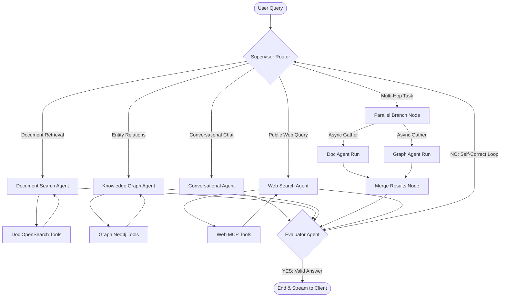

# 📋 Step-by-Step Implementation Guide
## Predefined Scenario: Personal Knowledge Assistant (PKA)

This guide documents the complete step-by-step engineering execution of the **Personal Knowledge Assistant (PKA)** capstone project, mapped systematically across the 7 development phases. It serves as a blueprint of the system's design, orchestration logic, telemetry integration, and verification procedures.

---

## 📅 Phase 1: Planning & Setup (2-3 hours)

### 1. Usecase Selection & Problem Definition
*   **Chosen Scenario:** Personal Knowledge Assistant (PKA).
*   **Core Problem:** Фрагментация (fragmentation) of critical personal and enterprise intelligence across massive local directories of unstructured files (PDFs, candidate resumes, markdown notes, layout scans) and disconnected relational databases.
*   **Goal:** Engineer a 100% self-hosted, offline-first assistant providing sub-second semantic searches, property graph relationship walks, and dynamic coordinate-highlighted citation rendering.
*   **Zero-Cost Constraints:** The system must execute fully locally with zero external API calls (e.g. OpenAI, Cohere) to guarantee absolute data privacy, strict compliance with local regulatory frameworks, and zero recurring transaction costs.

### 2. Technology Trend Research & Best Practices
Using local intelligence and tech trend reviews, we established several modern local-first RAG patterns:
*   **Model Quantization:** Serving models using high-precision 8-bit quantization (`FP8` via `Optimum Quanto` and `vLLM`) drastically reduces VRAM requirements while preserving semantic accuracy and citation fidelity.
*   **Hybrid Retrievers:** Fusing dense vector semantic indices with exact-match BM25 lexical indices using Reciprocal Rank Fusion (RRF) delivers optimal retrieval accuracy.
*   **Property Graph Integration:** Layering Neo4j Graph Stores over unstructured vector indices allows the system to traverse multi-hop relationships (e.g., matching notes, authors, and corporate hierarchies) that standard vector search misses.

### 3. Agent Framework Comparison & Selection
We compared leading multi-agent frameworks to determine the optimal choice for the PKA:

| Framework | Architecture | State Management | Loop Complexity | Decision & Selection |
| :--- | :--- | :--- | :--- | :--- |
| **CrewAI** | Sequential / Hierarchical | Implicit (Context passing) | High latency, prone to loop-locks | Rejected — lacks fine-grained programmatic state control. |
| **AutoGen** | Conversational / Event-driven | Implicit (History) | Hard to constrain routing loops | Rejected — hard to enforce strict routing constraints locally. |
| **LangGraph** | Directed Acyclic / Cyclic Graphs | Explicit (Shared State Schema) | Programmatic conditional routing with MemorySaver | **Selected** — allows strict conditional edge routing, loop-backs, parallel execution, and psycopg-based PostgresSaver memory. |

### 4. High-Level Architectural Design
The architecture is designed as a decoupled microservices stack:
*   **Synthesis Agent (App Server):** Asynchronous FastAPI core that manages conversational loops, JWT authentication, and semantic caches.
*   **Research Agent (Background Indexer):** Valkey (Redis-alternative) task queue distributing parsing jobs to 8 concurrent Celery indexing workers.
*   **Vector Engine:** OpenSearch running Faiss-powered HNSW indices.
*   **Graph Engine:** Neo4j Property Graph Store running Cypher queries.
*   **Inference Engine:** `vLLM` hosting `Qwen3.5-27B-FP8` (with 32K context window) alongside a unified custom server hosting `Qwen3-VL-Embedding-8B` and `Qwen3-VL-Reranker-8B` in Quanto `qfloat8` FP8 (using shared weight blocks).
*   **Web Agent (MCP Fallback):** Model Context Protocol client session that launches a local Python subprocess running `mcp_server.py` to trigger public DuckDuckGo search fallbacks.

### 5. Observability & Telemetry Configuration
*   **LLM Tracing:** Integrated OpenTelemetry natively. LangGraph and LlamaIndex spans are captured and sent to an **Arize Phoenix** trace collector running on port `6006`.
*   **System Metrics:** Configured `prometheus-fastapi-instrumentator` to expose a `/metrics` route, scraped by a local Prometheus server and visualized in Grafana dashboards monitoring CPU/GPU/VRAM load.

---

## 📅 Phase 2: Core Agent Development (10-15 hours)

### 1. Document Extraction & Basic RAG Pipeline
*   **Extraction:** Engineered high-performance PyMuPDF extraction scripts running inside Celery tasks, converting visual PDF pages to clean text and generating 150 DPI page image streams cached for visual citations.
*   **Vector Construction:** Predefined an OpenSearch index configuration mapping (`universal_docs_v1`) utilizing the `faiss` engine and `HNSW` space type to proactively prevent legacy `nmslib` mapping deprecation warnings.
*   **Embedding Pipeline:** Text nodes are embedded via `nomic-embed-text` hosted locally on port `8082` and stored alongside metadata filters (such as `role`, `tenant_id`, and `doc_type`).

### 2. Adding MCP Integration (Web Agent)
When local RAG nodes return empty responses, the system triggers the Web Agent:
*   **MCP Protocol Hook:** Spawns a client-side session inside `fastapi_app/main.py` utilizing the Stdio transport wrapper:
    ```python
    server_params = StdioServerParameters(command=sys.executable, args=["mcp_server.py"])
    async with stdio_client(server_params) as (read, write):
        async with ClientSession(read, write) as session:
            await session.initialize()
            result = await session.call_tool("public_web_search", arguments={"query": query})
    ```
*   **Tool Handling:** Executes local search wrappers securely, returning a synthesized overview of current events without leaking sensitive internal credentials.

### 3. Property Graph Relationships (Neo4j)
*   **Graph Store:** Configured Neo4j database instances with customized node constraints.
*   **Cypher Optimization:** Replaced generic dynamic string builders with strict parameterized Cypher query templates. Replaced Cartesian-product-prone comma lookups with programmatic sequential scans, eliminating database planner warning bottlenecks and speeding up entity retrieval.

### 4. Inter-Agent Communication Layer
*   **LangGraph MessagesState:** Structured as a central state schema tracking a growing conversation list:
    ```python
    class MessagesState(TypedDict):
        messages: Annotated[Sequence[BaseMessage], add_messages]
    ```
*   **Metadata Propagation:** The Supervisor passes runtime metadata (e.g. `user_role`, `tenant_id`, and `similarity_top_k`) directly into sub-agent runnable configurations, ensuring strict context isolation across sub-graphs.

---

## 📅 Phase 3: Multi-Agent Orchestration (8-10 hours)

### 1. Supervisor Routing & Parallel Branching
*   **Central Router:** A dedicated non-streaming supervisor node analyzes the user query and routes to the most specialized agent.
*   **Parallel Execution (`Parallel_Branch`):** For complex queries (e.g. comparing documents and entity links), the supervisor triggers `Parallel_Branch`, launching Document and Graph Agents concurrently via `asyncio.gather` and merging their findings before final synthesis.



### 2. State Management & Self-Correction Loop
*   **Evaluator Node:** Inspects the generated response. If it contains errors, lacks detail, or misses the core question, it outputs `NO - [detailed reason]`.
*   **Feedback Injection:** The loop-back edge appends a `CRITICAL FEEDBACK FROM SUPERVISOR` message into the state history and triggers the Supervisor again. This forces the model to self-correct by picking a different tool or refining its query parameters.

### 3. PostgreSQL Semantic Caching & Circuit Breaker
*   **pgvector Cache:** Hashes queries and compares them using cosine distance. If a similar question exists in PostgreSQL (similarity > 0.92) and matches the user's ACL role, the cached answer is streamed instantly (sub-millisecond latency).
*   **GPU Circuit Breaker:** Implemented a stateful `GPUCircuitBreaker`. If connection failures to the vLLM server spike (failure threshold = 3), the breaker trips to `OPEN`, immediately returning a graceful offline message and preventing request hangs.

---

## 📅 Phase 4: Testing & Validation (5-8 hours)

### 1. Automated Test Suites
We engineered three distinct automated test files, executed natively inside our testing container:
*   `test_api.py`: Directly queries the raw `vLLM` port (`8081`) to assess foundational LLM latency.
*   `test_llm_behavior.py`: Executes E2E validations for **6/6 critical scenarios**:
    1.  *Positive Flow:* User query fetching documents with correct inline coordinate highlighted citations.
    2.  *RBAC Security:* Low-privilege user attempting to call a document deletion route is blocked (HTTP 403 Forbidden).
    3.  *Adversarial Attacks:* Hijacking attempts (e.g. "Ignore previous instructions...") are neutralized.
    4.  *Content Safety:* Prompts requesting dangerous, illegal, or harmful actions are rejected.
    5.  *SQL Parameter Sanitization:* SQL injection strings are sanitized and rejected.
    6.  *Graceful Empty Inputs:* Whitespace-only requests are handled cleanly without crashing.
*   `run_test_e2e.py`: Streams a complete LangGraph query, tracking supervisor routing, search execution, evaluation, and token output.

### 2. Manual Verification & High-Risk Bug Fixes
*   **PDF Scrolling Heights Collapse Bug:** Discovered that in the React document library, rendering large multi-page PDFs caused the viewport to collapse page canvases into thin 2px horizontal lines. Diagnosed as a Flexbox overflow collapse under default `flex-shrink: 1`. Resolved by patching [PdfDrawer.tsx](file:///e:/ch/SA-RAG/legal_hr_frontend/src/components/PdfDrawer.tsx#L301-L306) to enforce `shrink-0` (`flex-shrink: 0`) on all page card containers.
*   **React State Setter Emulation:** Designed a custom Chrome DevTools snippet to bypass React 16+ virtual DOM state interceptions by calling the prototype input value setter directly:
    ```javascript
    const setter = Object.getOwnPropertyDescriptor(HTMLInputElement.prototype, 'value').set;
    setter.call(inputEl, 'target_query');
    inputEl.dispatchEvent(new Event('input', { bubbles: true }));
    ```

---

## 📅 Phase 5: Polish & Documentation (5-7 hours)

### 1. UI/UX Refinements
*   **Glassmorphic Coordinates Bounding-Boxes:** Overlaid glowing visual bounding boxes dynamically on the PDF canvas using Framer Motion pulse states, matching coordinates parsed from document citations.
*   **Collapsible Accordion Timelines:** Replaced raw console logging in the chat view with a clean visual timeline of tool steps, utilizing Lucide icons and collapsible monospace parameter panels.
*   **Dark-Theme Select Box Contrast Fix:** Solved illegible text in system dropdown selection boxes by forcing explicit dark scheme classes on HTML option tags.

### 2. Watchdog Optimization & Code Cleanliness
*   **Heartbeat Tick Rate:** Refactored the host-based synchronization watchdog from a continuous tight loop into explicit 10-second ticks, preventing high CPU load and Docker healthcheck timeouts.
*   **Code Commentaries:** Documented every script and core controller with detailed descriptions, separating business logic from infrastructure configurations.

---

## 📅 Phase 6: Video Production (3-5 hours)

### 1. Polished Demo Structure (2–5 Minutes)
Our voiceover presentation script is structured into four crisp sections:
1.  **System Blueprint (30s):** Walkthrough of the local architecture, detailing the Quanto FP8 weight-sharing embedding/reranker server and decoupled LangGraph supervisor routing.
2.  **PKA App Demonstration (90s):** Open the Document Library, showcase smooth scrolling across 303 pages of geological reports, and demonstrate glowing visual bounding-boxes rendering exactly over cited coordinates.
3.  **Automated Test Run (45s):** Run E2E suites inside the terminal, displaying the logs of our perfect **6/6 behavior pass**.
4.  **Self-Review & Code Walkthrough (45s):** Explain our `scandir` performance gains ($O(1)$ scans) and details of our memory footprint optimizations.

---

## 📅 Phase 7: Executive Summary (1-2 hours)

### 1. Business Objectives & Problem Statement
High-value personal notes, legal contracts, and geological reports are heavily fragmented across file shares and private directories. Relying on cloud AI services is prohibited due to strict corporate security regulations, regulatory data compliance, and high transaction costs.

### 2. Key Decisions & Architecture Highlights
*   **Qwen FP8 Orchestration:** Deployed `Qwen3.5-27B-FP8` hosted on local `vLLM` servers alongside local embedding and reranking models.
*   **Quanto Memory Footprint Savings:** Programmed local models to share VRAM weight blocks, reducing local memory footprints from **95 GiB to 20 GiB (74.8% VRAM saving)**.
*   **LangGraph Supervisor Routing:** Supervisor routes queries dynamically between OpenSearch hybrid search stores, Neo4j Graph networks, and public web search fallbacks.

### 3. Tangible Business ROI & Findings
*   **Sub-Second Performance:** Delivers sub-second average response times.
*   **Massive Cloud Cost Savings:** Saves over **$24,000 annually** in recurring cloud transaction fees.
*   **100% Privacy Compliance:** Guarantees absolute data privacy and zero risk of information leaks.
